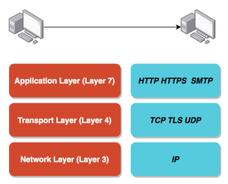
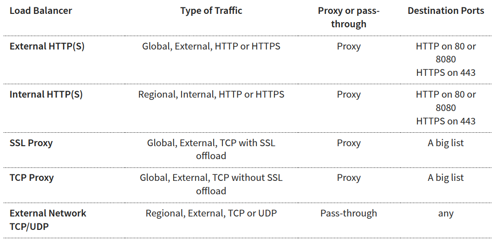

# GC Professional Cloud Architect notes

## Main concepts

Cloud allows you -> _On-demand resource provisioning AKA Elasticity_
    > Trade *capital expense* for *variable expense*
- Claenest cloud: Net carbon-neutral cloud

**Zones**: has one or more discrete clusters (distinct phisical infrastructure that is housed in a data center)
    - _Zones in a region are connected through low-latency links_

## Google Compute Engine (GCE)
Provision and manage virtual machines
- Type of workloads:
    - General Purpose (E2, N2, N2D, N1)
    - Memory optimized (M2, M1): Ultra high memory workloads -> Large in-memory databases and in-memory analytics
    - Compute Optimized (C2): Intensive workloads -> Gaming applications

    **Image**
    Operating system and software in the instance. Public and custom images

    **Satic IP addresses**
        - Can be switched to another VM
        - Remains attached. It must have manually detach it
        - You are **billed for it when you are NOT using it**

    **Reduce steps in a VM creation**
        - Startup scripts: _Bootstrapping: Install OS patched of software when an VM is launched_
        - **Instance template**: 
            - Define machine type, image, labels, startup script and other properties
            - Use to create VM instances and MIG
        - Custom image: OS patched and software pre-instaled

- Dedicated hardware for your compliance, licensing, and management needs -> **Sole-tenant nodes**
- **VM Manager** -> Automate OS patch management, OS inventory management and OS configuration management (manage software installed)
- **GPU**: Can be added. High performance for math intensive and grapihcs-intensive workloads
    - Higher cost
    - REMEMBER Use _images with GPU libraries_ (Deep learning) installed -> Otherwise, GPU will not be used

## Cloud Load Balancing
Distributes user traffic across instances of an application 

- Enables
    - High Availability
    - Auto scaling
    - Resiliency

    **HTTP vs HTTPS vs TCP vs TLS vs UDP**
    Computers use protocols to communicate

    - *Network Layer* - Transfer bits and bytes
        - **IP (Internet Protocol)**: Transfer bytes. Unreliable

    - *Transport Layer* - Are the bits and bytes transferred properly?
        - **TCP (Transmission Control)**: Reliability > Performance
        - **TLS (Transport Layer Security)**: Secure TCP
        - **UDP (User Datagram Protocol)**: Performance > Reliability

    - *Application Layer* - Make REST API calls and Send Emails
        - **HTTP(Hypertext Transfer Protocol):** Stateless Request Response Cycle
        - **HTTPS**: Secure HTTP
        - **SMTP**: Email Transfer Protocol

    

    Most applications typically communicate at **application layer** -> **TCP/TLS**
    If *high performance* is needed, then **directly communicate at transport layer** -> **UDP**

- Bakcend -> Endpoints that receive traffic
- Frontend -> Specify and IP address, port and protocol
- Hosts and path rules -> For HTTP(S). Define rules redirecting the traffic to different backends
- URL Maps: Route requests to backend services or backend buckets

#### Cloud Load Balancing - [Choosing Load Balancer](https://cloud.google.com/load-balancing/images/choose-lb.svg)

Features

- _Regional MIG can distribute instances in different zones of a single region_
- _HTTP(S) Load Balancing can distribute load to the multiple MIGs behind a single external IP address_

#### High Availability architecture
- Multiple regional MIGs for each microservice
- Distribute Load using a Global HTTPS Load balancing
- Configure Health Checks for MIG and Load Balancing
- Enable Live Migration for VM instances

## Compute and Balancing for Architects
**Security**
    - *Firewall rules* to restrict traffic
    - *Internal IP Addresses* as much as possible
    - *Sole-tenant nodes* when regulatory needs
    - *Custom image* to launch Vms
**Performance**
    - Choose right *machine family* for workload
    - Use GPUs and TPUs to increace performace
        GPUs -> Machine leaning and data processing
        TPUs -> Massive matrix operations performed in machine learning workloads

## Resiliency for Compute and Balancing
Ability of system to provide acceptable behavior even when one or more parts of the system fail
- Resilient architecture: VMs behind global load balancing
- Have right data available: 
    - Use *Cloud monitoring* for monitoring
    - Install *logging agent* to send logs to **Cloud logging**
- Be prepared for the unexpected (and changes)
    - Enable **live migration** and **atomatic restart** when available
    - Configure the right **health checks**
    - **Disaster recovery** Upto date image copied to multiple regions

**Always create Budget alerts** and make use of budget exports to stay on top of billing

