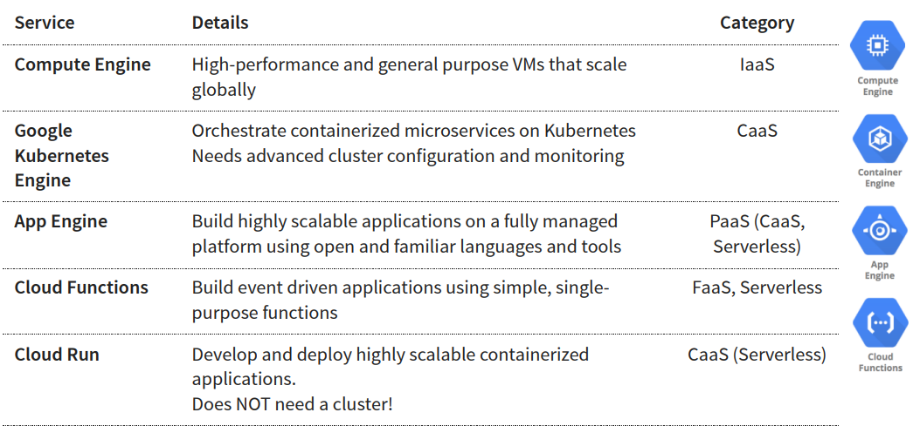

# Gcloud
Command line interface to interact with GC resources

> Some GC services have specific CLI tools:
    - Cloud storage - gsutil
    - Cloud BigQuery - bq
    - Cloud Bigtable - cbt
    - Kubernates - kubectl

**Cloud shell**: Backed by a VM instance -> After 120 days of inactivity, even $HOME dir is deleted

# Managed Services

**IAAS (Infrastructure as a Service)**
- Use only infrastructure from cloud provider
- Responsabilities:
    - Application code and runtime
    - Configuring load balancing
    - Auto scaling
    - OS upgrades and patches
    - Availability

**PAAS (Platform as a Service)**
- Cloud provider respon:
    - OS
    - App runtime
    - Auto scale, availability, etc
- I'm respon
    - Configuration
    - Application code
- Varieties: 
    - CAAS (Container as a Service)
    - FAAS (Function as a Service)
    - Data bases

**Microservices**
-> Small focused microservices
Useful _Containers - Docker_

## GCP Managed Services for Compute

## App Engine:
**Simplest way to deploy and scale applications**
    - Provides end-to-end application management
    - *No usage charges* - Pay for resources provisioned
    - Serverless
    - (-) Responsability (+) Flexibility

_Application component hierarchy_:
    - Application: One app per project
        -Service(s): Multiple microservices or apps components
            - Versions: Each associated with code and configuration  
    
_Scaling instances_
    - Automatic: Auto scale instances based on the load: For continuosly running workloads
    - Basic: Instances are created as and when request are received: For Adhoc workloads (instances are shutdown if ZERO request)
    - Manual: Configure specific number of instances to run

## Google Kubernetes Engine (GKE)
- Enable cloud logging and monitoring

**Cluser:** Group of Compute Engine instances
    - **Master Node(s)** - Manages the cluster
        Control plane components
            - API Server: Handles all comunication for a K8S cluster (from nodes and outside)
            - Scheduler - Decides placement of pods
            - Control Manager: Manages deployments & replicasets 
            - etcd: Distributed database storing tha cluster state
    - **Worker Node(s)** - Run your workloads (pods)
            - Kubelet: Manages communication with master node(s)

**Deployment vs Replica set**
- *Deployment*: Created for each microservice
- *Replica set*: Ensures that a specific number of pods are running for a specific microservice version

**Service**
Each pod has its own IP address
- Types of service:
    - ClusterIP
    - LoadBalancer
    - NodePort

### Container Registy - Image Repository
- Fully managed container registry (Alternative to Docker Hub)

